# Product Advertising BLE

**_[Language VietNamese]_**

* Hệ thống quảng cáo sản phẩm dựa trên công nghệ Bluetooth Mobile & Raspberry Pi - là đề tài luận văn tốt nghiệp do tôi [Nguyễn Thanh Huy](https://www.facebook.com/profile.php?id=100007416721622) thực hiện và đã bảo vệ luận văn tốt nghiệp vào tháng 12/2021. Hệ thống được chia làm 2 phần: Mobile app(quét các gói quảng cáo Bluetooth) và phần mềm(phát các gói quảng cáo bluetooth) chạy trên Raspberry Pi 4B. Mô hình có thể ví như tờ rơi quảng cáo như được số hóa thành tờ rơi điện tử, khi người dùng bật app và cho app chạy nền thì, khi mỗi lần bạn đi ngang qua 1 thiết bị phát quảng cáo(Raspberry Pi) thì Smartphone đó sẽ **tự động nhận được** tờ rơi điện tử mà **không cần phải kết nối** giống như tai nghe. Mục đích của việc này là giúp giải phóng sức lao động cho con người vào công việc phát tờ rơi quảng cáo, poster... Luận văn tốt nghiệp được phát triển trong thời gian chống dịch Covid-19 nằm việc quảng cáo tránh tiếp xúc gần.

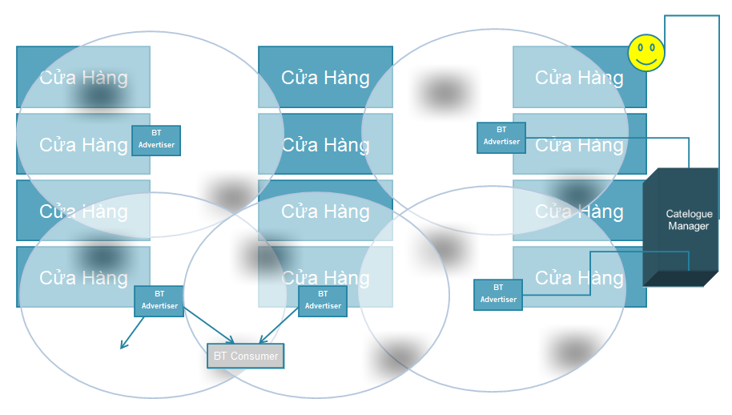 

  * Phần hệ thống(Raspberry Pi 4B)
    * ứng dụng phát quảng cáo được viết bằng Python và sử dụng thư viện [BlueZ](http://www.bluez.org/)
	* Giao thức AMQP(RabittMQ - Pika) dùng để làm client gửi yêu cầu nhận Json từ Web Server truyền các gói quảng cáo sản phẩm.
	
	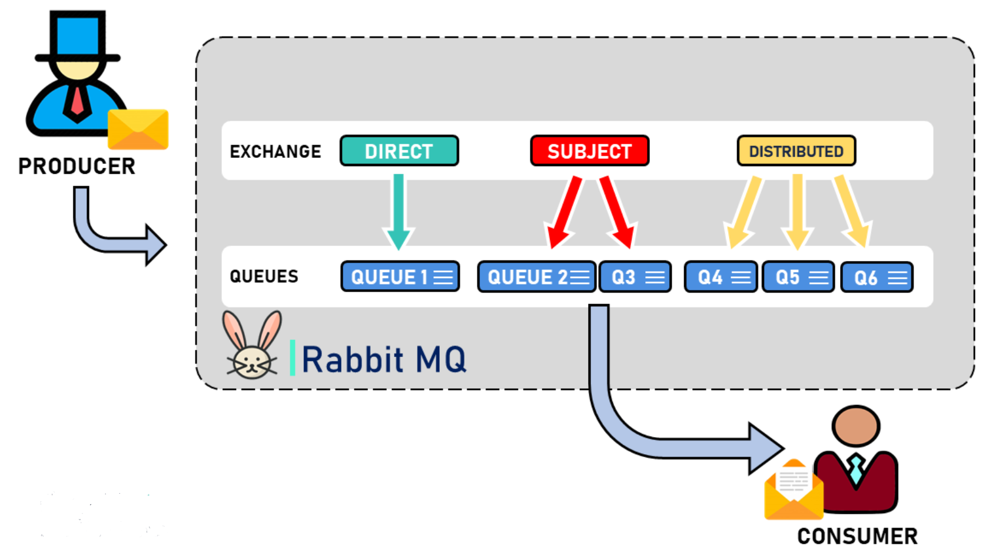 
	
  * Phần ứng dụng(Android)
    * Ứng dụng nhận các gói quảng cáo Bluetooth được viết bằng Java.
	* Dữ liệu quảng cáo được lưu trữ cơ sở dữ liệu quan hệ SQLite.
	
* Để hiểu thêm về **Hệ thống quảng cáo sản phẩm dựa trên công nghệ Bluetooth** đầy đủ, mời bạn có thể tham khảo tài liệu do tôi viết [tại đây.](./Document.pdf)

## 🔑Features

  * **Phần hệ thống(Raspberry Pi 4B)**
  
    * Phát các gói tin quảng cáo dựa trên tầng **Generic Access Profile(GAP)** của giao thức Bluetooth.
	
	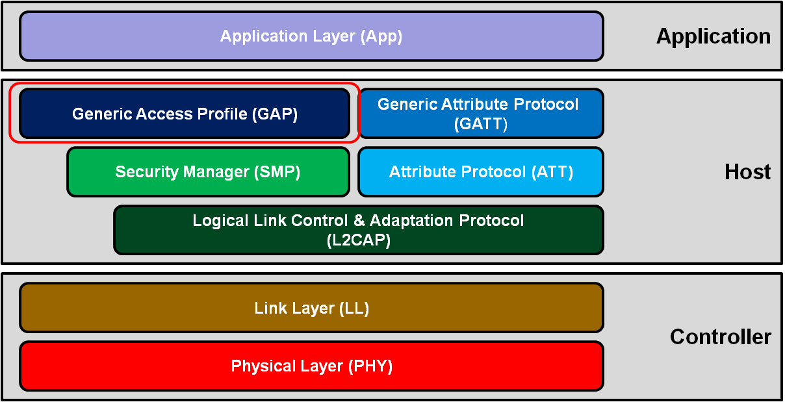

    * Gửi các gói tin quảng các bắt buộc trên 3 kênh: 37, 38, 39
	
	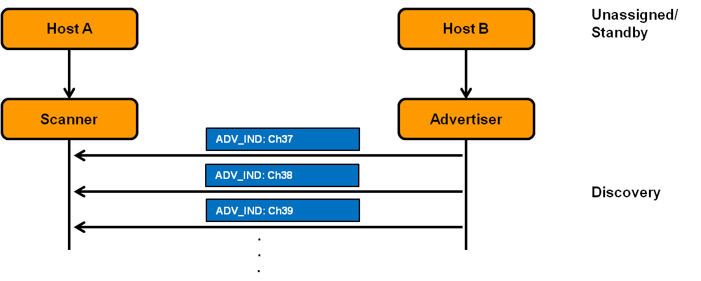
	
	* Nhận các catalogue quảng cáo sản phẩm đẩy xuống hàng đợi RabittMQ và dùng thư viện Pika lấy Json về và lưu trong bộ nhớ Raspberry Pi.
	* Giải mã Json catalogue sản phẩm và đẩy cho ngăn xếp Bluetooth phát các gói tin quảng cáo.
    * Tự động cắt chuỗi dữ liệu quảng cáo dựa trên giải thuật **Flag byte with byte stuffing**.
	* Tự động gán nhãn các gói tin quảng cáo phát ra dựa trên giải thuật **Maximum Transmission Unit**.
  
  * **Phần ứng dụng quét gói tin quảng cáo (Smartphone Android)**
    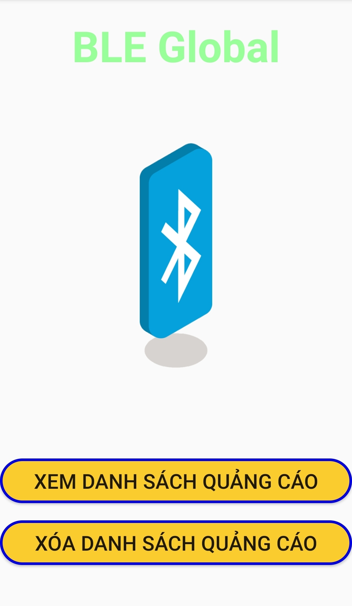
  
    * Ứng dụng chạy nền chỉ cần bạn đi ngang qua 1 thiết bị phát quảng cáo(Raspberry Pi) thì Smartphone của bạn tự động nhận được các gói tin quảng cáo, và tự động tập hợp lại thành 1 tờ rơi điện tự.
	  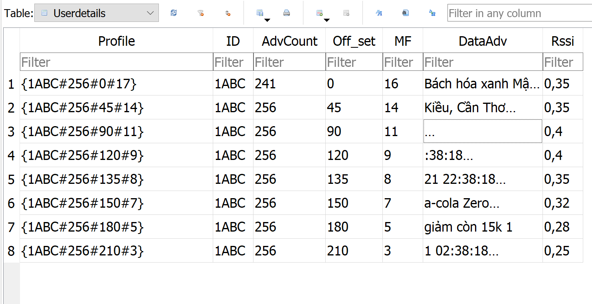
	
	* Tính năng tự động lọc các gói quảng cáo dựa trên dịch vụ quảng cáo UUID 16 bits.
	* Các gói tin quảng cáo được lưu trữ bởi cơ sở dữ liệu SQLite.
	* Khi nhận tổng hợp đủ các gói quảng do giải thuật **Maximum Transmission Unit** gán nhãn tách gói, thì sẽ tạo thành 1 danh sách quảng cáo các sản phẩm và hiện trên màn hình.
	  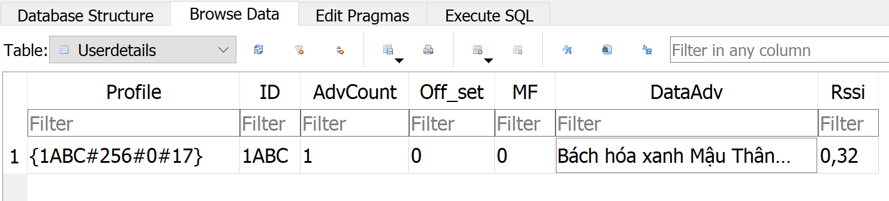
	  
	  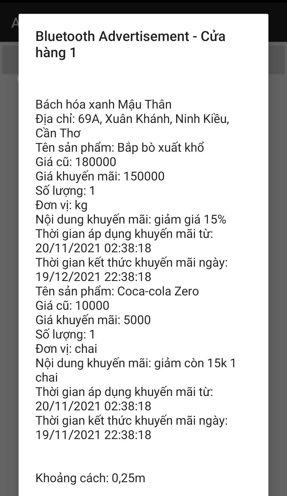
	
## 🔧Installation setup

### Giải thuật sử dụng các byte làm cờ và các byte độn (Flag byte with byte stuffing)
  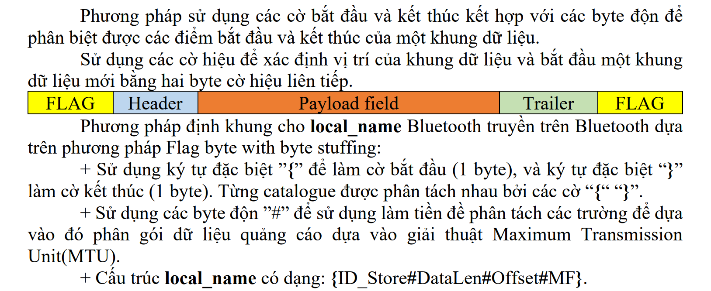
  
### Giải thuật Maximum Transmission Unit(MTU)
  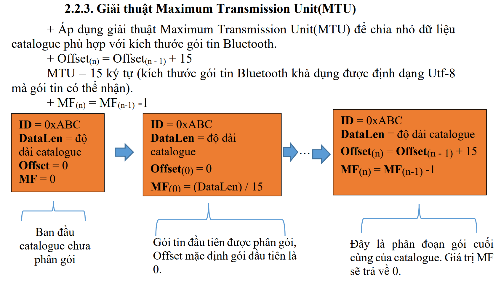
  
### Cấu trúc packet Header quảng cáo đầu tiên được phân đoạn
  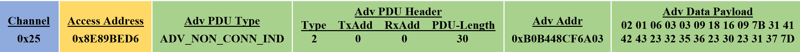
  
### Cấu trúc packet Data quảng cáo đầu tiên được phân đoạn
  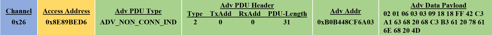
  
### Cấu trúc packet Header quảng cáo cuối cùng được phân đoạn
  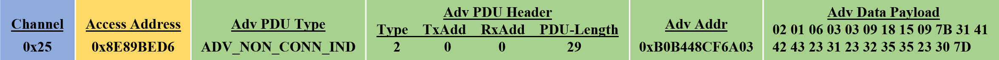
  
### Cấu trúc packet Data quảng cáo cuối cùng được phân đoạn
  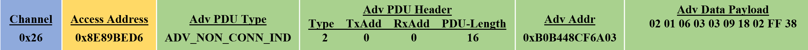

## 📘Main libraries used
* [Thư viện BlueZ](http://www.bluez.org/) dùng để phát các gói tin quảng cáo Bluetooth.
* [Thư viện Pika.](https://pika.readthedocs.io/en/stable/#)
* [Tài liệu tổng quan vể Bluetooth.](https://microchipdeveloper.com/wireless:ble-gap-overview)
* [Tài liệu tham khảo lập trình Bluetooth trên nền tảng Android.](https://developer.android.com/reference/classes)

* Để hiểu thêm về **Hệ thống quảng cáo sản phẩm dựa trên công nghệ Bluetooth** đầy đủ, trực quan..., mời bạn có thể tham khảo tài liệu do tôi viết [tại đây.](./Document.pdf)

## 🌏Other Social Media

📌[GitHub](https://github.com/HuygaoBE)

📌[FaceBook](https://www.facebook.com/profile.php?id=100007416721622)

Vui lòng đánh giá sao cho các dự án của tôi trên GitHub, để tôi có thêm động lực để tạo ra nhiều dự án hữu ích cho cộng đồng.
